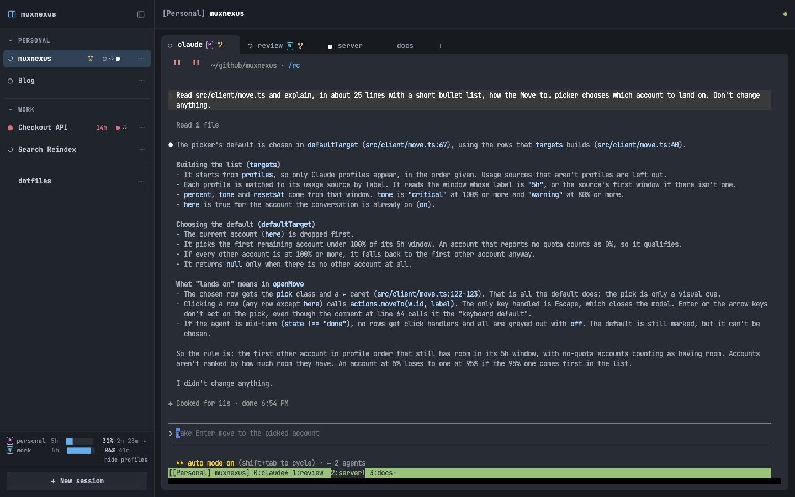
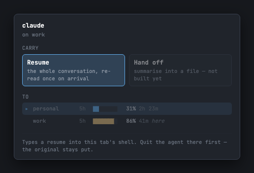
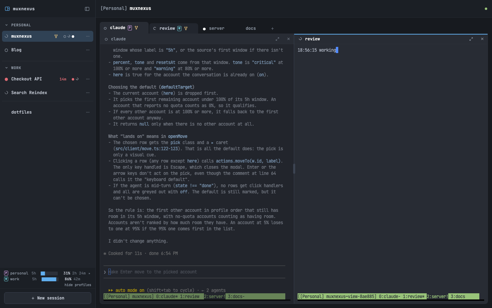
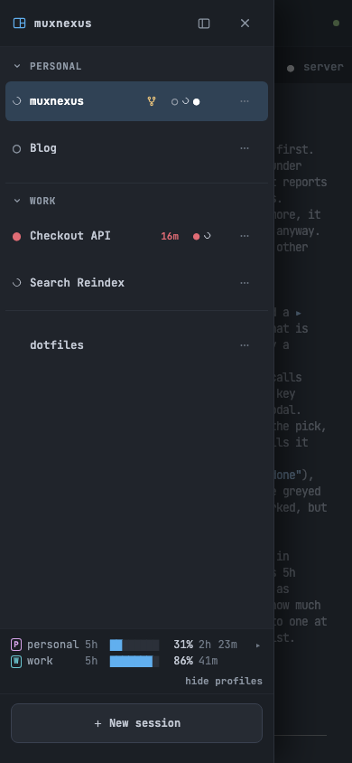
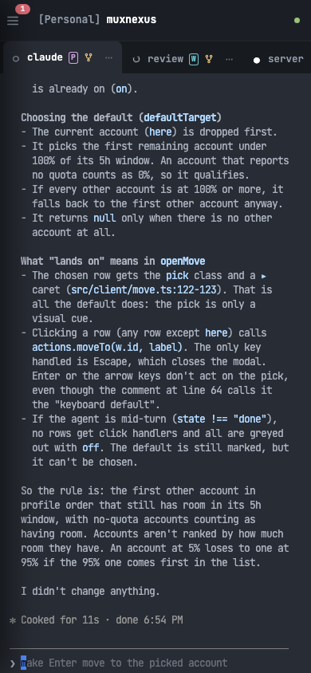

# muxnexus

**What if the laptop could just… stay home?**



cmux runs Claude Code inside tmux on my Mac. The sessions live on that Mac, which
meant the Mac came with me everywhere — a 14" MacBook Pro in a bag, carried across
town for a twenty-minute terminal session. (Maybe I'm the only one who finds it
heavy. Just me? Okay.)

But tmux doesn't care where I am. Those sessions keep running whether I'm sitting
at the desk or not. The only missing piece was a way to reach them that wasn't
another laptop.

So that's what this is: a web UI for the tmux server already running on your
machine. Reach it over Tailscale or Cloudflare Access from an iPad, a lighter
laptop, a phone — and you land in the same sessions cmux is looking at. The iPad
can keep something playing in the other half of the screen, which the MacBook was
never going to let me do gracefully.

## What you get

- **Your real sessions, in a tab.** The tmux server that's already running, not a
  copy of it. Type in the browser, look up at the desk, and it's the same terminal.
- **Which agent needs you, at a glance.** Every session and tab says whether its
  Claude Code is waiting on you, working, or done — and ⌘J jumps to the next one
  that's waiting.
- **Quota for every account you have.** Each Claude profile's 5-hour and weekly
  windows sit at the foot of the sidebar, and every tab wears a badge naming the
  account it's spending.
- **Move a conversation to another account.** One account nearly spent? Carry the
  tab's conversation to the other one without hunting for a session id.
- **Two tabs side by side.** Drag a tab onto the terminal to open it beside the
  one you're in.
- **Groups.** Tag a session `[Work] …` and it files itself under **Work** — and
  starts on the work account.
- **Works on a phone and an iPad.** The sidebar becomes a drawer; dragging to
  reorder works with a long press.

## Setup

```sh
git clone https://github.com/SilverPlatedOps/muxnexus.git && cd muxnexus
./scripts/install.sh
```

The script checks for bun, tmux and Tailscale, offers to install whatever is
missing — one confirmation each, nothing installed behind your back — pulls
dependencies, and optionally wires the cmux guard into your `~/.zshrc` (it backs
the file up first). Safe to run again; it checks before it acts.

Then start it:

```sh
bun run start
```

Open the URL it prints from any device on your tailnet.

The agent status, the account badges and Move to… come from a small Claude Code
hook that stamps each tmux pane with what its agent is doing. The install script
doesn't add it; this does, for every profile it finds (`~/.claude`,
`~/.claude-*`):

```sh
python3 scripts/install-agent-hook.py
```

It adds entries to each profile's `settings.json` and backs the file up before
changing it; running it again changes nothing. The entries point at this
checkout's `scripts/agent-state.sh` by absolute path, so if you move the clone,
run it again. Without the hook muxnexus still works — the sidebar just can't
tell you what your agents are up to.

> **There is no authentication. None.** The tailnet is the auth. Don't put this on
> a public interface.

### Running it

| Command | What it does |
| --- | --- |
| `bun run start` | Binds your Tailscale IPv4 on port 7681 |
| `bun run start -- --port 8080` | Serve on another port |
| `bun run start -- --host 127.0.0.1` | Bind somewhere other than the tailnet; repeatable |
| `bun run start -- --socket <path>` | Drive a specific tmux server |
| `bun run start -- --allow-host <name>` | Answer to another hostname; repeatable |
| `bun run dev` | Binds 127.0.0.1, restarts on change |
| `bun run setup` | The install script again |
| `bun test` | Tests |

`start` resolves the bind address with `tailscale ip -4` and refuses to start if
Tailscale is down. Pass `--host <addr>` to bind elsewhere — Cloudflare Access in
front of `127.0.0.1` works just as well.

It listens on your Tailscale address *and* on loopback, so `localhost` works at
the desk while the tailnet serves everything else. `--host` may be repeated to
add more; a wildcard (`0.0.0.0`) is left alone, since it covers loopback already
and answers on every network the machine later joins -- it warns about that.

It answers to the addresses it is bound to, to loopback, and to this machine's
MagicDNS name — so reaching it from a phone by name works without setting
anything up. Any other name needs `--allow-host`, which is what a reverse proxy
on its own domain wants. The names it will answer to are printed at startup.

That list is a DNS-rebinding guard, not authentication. It stops a page on the
public internet from pointing its own domain at your tailnet address and driving
your terminal through your browser. Comparing `Origin` to `Host` cannot do this
on its own: an attacker serving from their domain on this port controls both
headers, and they agree.

### Manual control

`bun run start` holds the terminal. For a server you start once and leave alone,
the installer can add a `muxnexus` alias (or call `./scripts/muxnexusctl`):

```sh
muxnexus start            # background, detached; pass server args after --
muxnexus stop
muxnexus restart
muxnexus status
muxnexus logs             # tail -f the log
```

It keeps a pidfile and log under `~/.local/state/muxnexus/`, and `stop` also
finds a server you started some other way.

### Which tmux server

muxnexus drives exactly one tmux server, chosen at startup:

1. `--socket <path>`, if you passed it (tmux's `-S`).
2. Otherwise cmux's own server at `~/.cmux/local-tmux/server.sock`, when that
   socket exists — so the browser and cmux share one set of sessions with no
   extra setup.
3. Otherwise tmux's default socket. **cmux is not required.**

Whichever it picks is printed at startup.

## Why not something that exists

- **cmux's iPhone app** — in beta, but it's an app to install and pair, and there's
  no web client. That's the gap this fills.
- **[Orca](https://github.com/stablyai/orca)** — its unit of work is a git worktree.
  Mine is the terminal I already had open.
- **Claude's own apps** — they render the session *as an app*. I want the terminal,
  because that's where everything else I run already lives.

### About the name

Not affiliated with [cmux](https://github.com/manaflow-ai/cmux), and not trying to
be the official anything. cmux is excellent and the people building it deserve
every bit of credit they get — "nexus" is just the bridge I needed. If their mobile
story grows into this, use theirs.

## Keys

| Key | Action |
| --- | --- |
| `Cmd+B` | Toggle the sidebar |
| `Cmd+J` | Jump to the next session waiting on you (`Cmd+Shift+J` too, for iPad Safari) |
| `Cmd+F` | Find in scrollback |
| `Cmd+C` | Copy the selection (no selection: nothing) |
| `Cmd+V` | Paste (bracketed paste, forwarded by tmux) |
| everything else | Sent to tmux, including `C-b` prefix keys |

With the divider between two side-by-side panes focused, the arrow keys resize
them and `Home`/`End` jump to 20% and 80%.

## Which agent needs you

With the hook installed, every row in the sidebar and every tab carries a mark:

| Mark | Means |
| --- | --- |
| red `●` | Waiting for you — a permission prompt or a question. The row says for how long. |
| spinning arc | Working on a turn |
| white `●` | Something in it rang the terminal bell since you last looked |
| `○` | Idle |

A session shows the most urgent of its windows, and a folded group the most
urgent of its sessions, so nothing waiting can hide. `Cmd+J` walks down the
sidebar to the next one that wants you.

When two agents are working in the same git checkout, both rows get a yellow
branch mark naming each other — they're about to edit the same files. Separate
`git worktree`s don't count: they are the fix. An agent shows the mark once it
has taken a turn since the hook was installed.

Pressing Esc mid-turn doesn't fire any Claude Code hook, so muxnexus reads the
interruption from the conversation's transcript instead — the row goes idle
rather than spinning for ever.

## Quota, and which account each tab spends

The foot of the sidebar shows every Claude account on the machine — each
`~/.claude*` directory with a `projects/` folder in it is one — with its 5-hour
window, and its weekly ones behind the `▸`. Each reset is written the way you'd
plan around it: `41m`, `2h 23m`, then `Fri 8pm`. A bar changes colour when the
provider itself flags the window as close to its limit.

Every tab with an agent wears its account's badge — the letter and colour from
its row in the panel — so you can see which quota a tab is burning before you
give it a big job. `hide profiles` switches the badges off.

The numbers come straight from Anthropic's usage endpoint, using the credentials
Claude Code already keeps in the macOS Keychain. muxnexus only ever reads them:
it never refreshes a token or writes one back. So the panel is macOS-only for
now. If you use opencode Go, its quota gets a row too.

## Move a conversation to another account



A tab's `⋯` menu has **Move to…**. Pick an account and muxnexus quits the agent
in that tab, then resumes the same conversation in the same tab under the other
account — the scrollback stays, so the last thing it said is still on screen.
It forks rather than continuing in place, so the conversation shows up in the
new account's own `/resume`, and the original stays where it was.

The dialog puts each account's quota beside it, because resuming re-reads the
whole conversation once: moving a long one onto an account that's nearly spent
defeats the point. It won't touch a tab whose agent is mid-turn — that one is
yours to interrupt.

## Two tabs side by side



Drag a tab onto the terminal to open it beside the one you're in — drop it on
the left or right half to choose the side — or pick **Open beside** from its
`⋯` menu. Each pane is a real terminal of its own; the divider drags, and either
pane can be closed or zoomed to full width. It needs a screen wider than a phone.

## On a phone

<p>


</p>

On a narrow screen the sidebar becomes a drawer behind the `☰`, and the tab
strip scrolls sideways. Sessions and tabs reorder by dragging everywhere; on
touch, hold for a moment first so the drag doesn't fight scrolling.

## Grouping sessions

Start a session's name with a tag in brackets, `[Work] Banner Migration`, and the
sidebar groups it under a **Work** header with every other `[Work]` session.
Headers fold, and a folded one still shows the most urgent state inside it.

When the tag names one of your Claude profiles, a session created here as
`[Work] ...` starts with `CLAUDE_CONFIG_DIR` set to `~/.claude-work`, so `claude`
(and `cc`) in any of its windows spends the work account. The default profile is
never set explicitly. Renaming a session into a tag does not change its
environment; only creating it does. Running a `[Work]` session on another account
on purpose is fine — its tabs' badges say so, and nothing nags about it.

Sessions and tabs reorder by dragging; the order is kept on the server, so every
device sees the same one.

## Using it with cmux

cmux's local-tmux feature runs its own tmux server (`cmux local-tmux list` shows
its sessions). muxnexus uses that server by default, so a session created in
either place shows up in the other, and the browser can open cmux workspaces to
match.

The details — how workspaces map to sessions, what the guard does, and the tmux
sizing caveats worth knowing — are in
[docs/cmux-internals.md](docs/cmux-internals.md).

## Docs

- [docs/cmux-internals.md](docs/cmux-internals.md) — workspace/session mapping,
  the `~/.zshrc` guard, tmux sizing behaviour
- [docs/smoke-test.md](docs/smoke-test.md) — the checklist to run after touching
  the server or PTY layer

## Licence

[MIT](LICENSE). Do what you like with it.
